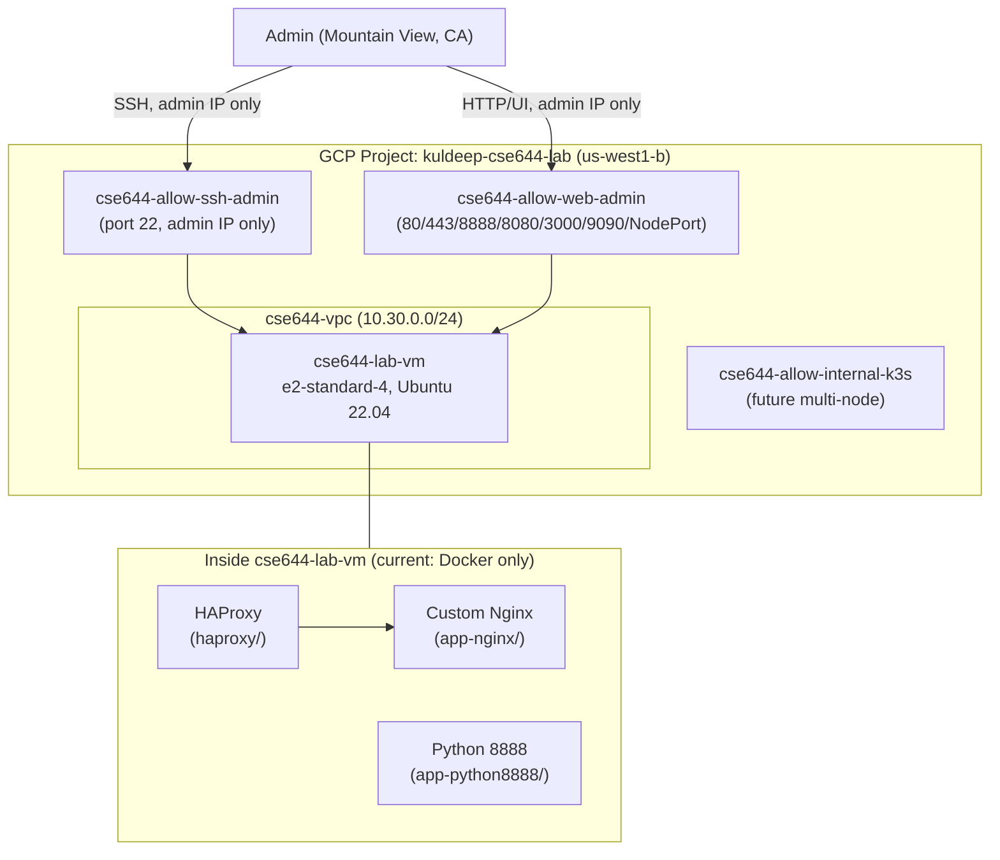

# CSE644 Cloud Computing — Consolidated Lab

A single, production-like GCP build covering all three CSE644 assignments — Docker, Kubernetes, and GitOps/Observability — on one Terraform-provisioned VM, instead of three disconnected exercises.

## Submission Info

- **Name:** Kuldeep Jain
- **Docker Hub:** [kuldeepjain1920](https://hub.docker.com/u/kuldeepjain1920)
- **GitHub:** [kuldeepjain1920](https://github.com/kuldeepjain1920)
- **GitHub Repository:** [kuldeepjain1920/cse644-cloud-lab](https://github.com/kuldeepjain1920/cse644-cloud-lab)

## Status

| Assignment | Status |
|---|---|
| 01 — Docker | ✅ Complete |
| 02 — Kubernetes | ⏳ Pending |
| 03 — GitOps + Observability | ⏳ Pending |

## Architecture (current state)



Kubernetes (k3s), Argo CD, and Prometheus/Grafana land on this same VM in later phases — see the assignment runbooks below.

## Repository Structure

```
cse644-cloud-lab/
├── app-nginx/          # Assignment 01: custom Nginx image + page
├── app-python8888/     # Assignment 01: Python web server, port 8888
├── haproxy/            # Assignment 01: HAProxy reverse-proxy stack
├── terraform/
│   ├── single-vm/       # Graded build — single VM, k3s (in progress)
│   ├── multi-vm/        # Future extension — 3-node k3s
│   └── gke-autopilot/   # Future extension — managed GKE
└── docs/
    ├── phase0-foundation-runbook.md      # GCP + Terraform setup
    ├── assignment-01-docker-runbook.md   # Assignment 01 details
    └── cse636-vm-migration-runbook.md    # Unrelated CSE636 asset move (see note below)
```

## Docker Hub Images (Assignment 01)

- [kuldeepjain1920/cse644-nginx-custom](https://hub.docker.com/r/kuldeepjain1920/cse644-nginx-custom)
- [kuldeepjain1920/cse644-python-webserver](https://hub.docker.com/r/kuldeepjain1920/cse644-python-webserver)

## Documentation

- **[docs/phase0-foundation-runbook.md](docs/phase0-foundation-runbook.md)** — how the GCP project, VPC, firewall, and VM were provisioned via Terraform; the region/sizing decisions and why; the billing-quota issue hit along the way (summarized, full detail linked separately)
- **[docs/assignment-01-docker-runbook.md](docs/assignment-01-docker-runbook.md)** — the Docker assignment itself: concepts demonstrated, code reuse from the original build, full command walkthrough, issues hit and resolved, Docker Hub push, evidence checklist, and environment cleanup
- **[docs/cse636-vm-migration-runbook.md](docs/cse636-vm-migration-runbook.md)** — a one-time, unrelated housekeeping task (moving a separate CSE636 course VM between GCP projects to free a billing-account slot). Included here only because it happened during this session's setup; it is not part of the CSE644 assignment work.

## A Note on Scope

This repo intentionally goes further than the assignment strictly requires — real Terraform-provisioned infrastructure, a dedicated GCP project, restrictive firewall rules, and a build designed to extend cleanly into multi-node Kubernetes and GKE Autopilot afterward. The goal is a portfolio-quality artifact, not just a passing submission.
