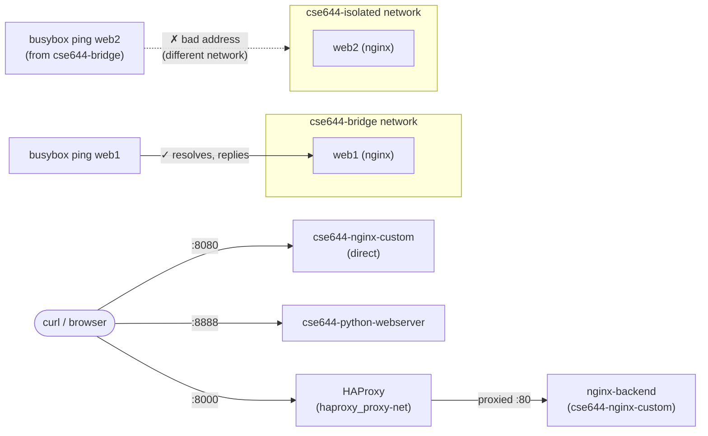

# Assignment 01 — Docker

Full walkthrough of the CSE644 Docker assignment, executed on `cse644-lab-vm` (see [phase0-foundation-runbook.md](phase0-foundation-runbook.md) for how that VM came to exist).

## Concepts demonstrated

| Concept | Where |
|---|---|
| Custom image build (multi-stage-free, `FROM` + `COPY`) | `app-nginx/`, `app-python8888/` |
| Container lifecycle (build → run → exec → inspect) | throughout |
| Reverse proxy pattern | `haproxy/` — HAProxy as an L7 front for Nginx |
| User-defined bridge networking + service discovery by container name | `haproxy/docker-compose.yml`, bridge network demo |
| Data persistence independent of container lifecycle | named Docker volume demo |
| Network isolation as a security boundary | isolated-network demo |
| Registry workflow (build → tag → auth → push) | Docker Hub section below |

## Architecture / traffic flow



## Code reuse — what came from the original Mac UTM build

The Dockerfiles, HAProxy config, and app source were originally written and run on an Ubuntu Server ARM64 VM under UTM on a MacBook Air M1, committed to a separate repo: [`kuldeepjain1920/cse644-docker-assignment`](https://github.com/kuldeepjain1920/cse644-docker-assignment).

Everything in that repo was **portable as-is** — no code changes were needed to run on this GCP VM. That's expected: none of it referenced host-specific paths, architecture (the images build fine on x86_64 despite originally running on ARM64, since the base images are multi-arch), or anything tied to UTM specifically.

Steps followed to bring it into this repo's structure:

```bash
# on cse644-lab-vm
cd ~
git clone https://github.com/kuldeepjain1920/cse644-docker-assignment.git
git clone https://github.com/kuldeepjain1920/cse644-cloud-lab.git
cd cse644-cloud-lab
git checkout phase-0-foundation

mkdir -p app-nginx app-python8888 haproxy
mv ~/cse644-docker-assignment/nginx-custom/*     app-nginx/
mv ~/cse644-docker-assignment/python-webserver/* app-python8888/
mv ~/cse644-docker-assignment/haproxy-nginx/*    haproxy/
```

| Original folder | New location |
|---|---|
| `nginx-custom/` | `app-nginx/` |
| `python-webserver/` | `app-python8888/` |
| `haproxy-nginx/` | `haproxy/` |

## Docker installation

Fresh Ubuntu 22.04 VM, so Docker needed a clean install from Docker's official apt repo:

```bash
sudo apt update
sudo apt install -y ca-certificates curl gnupg
sudo install -m 0755 -d /etc/apt/keyrings
curl -fsSL https://download.docker.com/linux/ubuntu/gpg | sudo gpg --dearmor -o /etc/apt/keyrings/docker.gpg
sudo chmod a+r /etc/apt/keyrings/docker.gpg

echo \
  "deb [arch=$(dpkg --print-architecture) signed-by=/etc/apt/keyrings/docker.gpg] https://download.docker.com/linux/ubuntu \
  $(. /etc/os-release && echo "$VERSION_CODENAME") stable" | \
  sudo tee /etc/apt/sources.list.d/docker.list > /dev/null

sudo apt update
sudo apt install -y docker-ce docker-ce-cli containerd.io docker-buildx-plugin docker-compose-plugin
sudo usermod -aG docker $USER
newgrp docker   # or log out/back in, to pick up the new group membership
```

Verified with `docker run hello-world` — confirmed daemon connectivity, image pull, and container execution end-to-end.

## Custom Nginx image

```bash
cd app-nginx
docker build -t cse644-nginx-custom .
docker run -d --name nginx-custom -p 8080:80 cse644-nginx-custom
curl http://localhost:8080
```

Result: custom `index.html` served correctly on port 8080.

## Python web server (port 8888)

```bash
cd app-python8888
docker build -t cse644-python-webserver .
docker run -d --name python-webserver -p 8888:8888 cse644-python-webserver
curl http://localhost:8888
```

Result: `Hello from CSE644 Python web server on port 8888`

## HAProxy → Nginx reverse proxy

```bash
cd haproxy
docker compose up -d
curl http://localhost:8000
```

`docker-compose.yml` builds a dedicated `proxy-net` bridge network, runs `nginx-backend` (the same `cse644-nginx-custom` image) and `haproxy` (official image, config mounted read-only), with HAProxy forwarding port 8000 → the backend's port 80 by container name — no manual IP wiring needed.

Result: same custom Nginx page, now served through the proxy.

## Persistent volume demo

```bash
docker volume create cse644-data
docker run --rm -v cse644-data:/data busybox sh -c "echo 'Persistent Hello CSE644' > /data/test.txt"
docker run --rm -v cse644-data:/data busybox cat /data/test.txt
```

Two entirely separate, `--rm`-removed containers — the second reads what the first wrote, proving the data lives in the **volume**, not in any one container's writable layer.

Result: `Persistent Hello CSE644` — confirmed readable after the writing container was gone.

## Docker networking modes

**Bridge** (user-defined network, DNS-based service discovery):
```bash
docker network create cse644-bridge
docker run -d --name web1 --network cse644-bridge nginx
docker run -it --rm --network cse644-bridge busybox ping -c 3 web1
```
Result: 3/3 packets, 0% loss — `web1` resolved by container name.

**Host** (container shares the VM's network namespace directly, no port mapping):
```bash
docker run -d --name web-host --network host nginx
curl http://localhost:80
```
Result: default Nginx page served directly on the host's port 80.

**Isolated** (proving network separation):
```bash
docker network create cse644-isolated
docker run -d --name web2 --network cse644-isolated nginx
docker run -it --rm --network cse644-bridge busybox ping -c 3 web2   # expected to fail
```
Result: `ping: bad address 'web2'` — correct and expected. Docker's embedded DNS only resolves container names within the *same* user-defined network; a container on `cse644-bridge` has no way to even look up a name that only exists on `cse644-isolated`. This is the intended proof of isolation.

## Docker Hub authentication and push

```bash
docker login -u kuldeepjain1920
# password prompt: paste a Docker Hub Personal Access Token (Read & Write scope),
# not the account password — generated at hub.docker.com/settings/security
```
Result: `Login Succeeded` — satisfies the assignment's CLI-authentication evidence requirement.

```bash
docker tag cse644-nginx-custom kuldeepjain1920/cse644-nginx-custom:latest
docker tag cse644-python-webserver kuldeepjain1920/cse644-python-webserver:latest
docker push kuldeepjain1920/cse644-nginx-custom:latest
docker push kuldeepjain1920/cse644-python-webserver:latest
```

Both pushed successfully with clean digests. Links:
- https://hub.docker.com/r/kuldeepjain1920/cse644-nginx-custom
- https://hub.docker.com/r/kuldeepjain1920/cse644-python-webserver

## Issues hit and resolved

| Issue | Cause | Fix |
|---|---|---|
| First `curl` after `docker run -d` returned `Connection reset by peer` / `Failed to connect` | Race condition — curl ran before the just-started container finished initializing (Nginx/Python startup takes a second or two) | Added a short `sleep` before curl, or simply retried a couple seconds later; `docker logs <container>` confirmed the service itself was healthy throughout |
| `tree` / `apt install` failed with lock/permission errors on first use | Fresh VM's apt package index cache was stale/incomplete | `sudo apt update` before installing anything new |

## Evidence checklist (against the assignment's Required Evidence Checklist)

- [x] Docker installation — `docker --version`, `docker compose version`, `hello-world` run
- [x] Docker Hub account and CLI authentication — `docker login` → `Login Succeeded`
- [x] Docker image pull — `hello-world`, base images (`nginx`, `python:3.12-slim`, `busybox`, `haproxy`)
- [x] Container run — all containers above
- [x] Interactive exec session — implicit via `docker run -it ... busybox ping`
- [x] Customized Nginx image — `app-nginx/`, verified serving custom page
- [x] Python web server image — `app-python8888/`, verified on port 8888
- [x] HAProxy proxying traffic to Nginx — verified via `curl :8000`
- [x] Persistent volume behavior — verified data survives container removal
- [x] Bridge network connectivity — verified via successful ping
- [x] Host network demonstration — verified via direct port 80 access
- [x] Isolated network behavior — verified via expected ping failure
- [x] Docker Hub image upload — both images pushed, links above
- [x] GitHub repository upload — this repo

## Environment cleanup (post-assignment, pre-Assignment-02)

Before state — `docker ps -a` showed 7 containers (5 running: `web2`, `web-host`, `web1`, `haproxy`, `nginx-backend`, `python-webserver`, `nginx-custom`; 1 exited: `hello-world`'s `practical_payne`), `docker network ls` showed 3 custom networks (`cse644-bridge`, `cse644-isolated`, `haproxy_proxy-net`) alongside Docker's defaults, `docker volume ls` showed `cse644-data`.

```bash
cd haproxy
docker compose down
docker rm -f web1 web2 web-host nginx-custom python-webserver
docker rm practical_payne
docker network rm cse644-bridge cse644-isolated
docker volume rm cse644-data
```

After state — `docker ps -a` empty, only Docker's built-in `bridge`/`host`/`none` networks remain, no volumes. Built images (`cse644-nginx-custom`, `cse644-python-webserver`) were deliberately kept, since they're the actual deliverable and already pushed to Docker Hub.

VM was then stopped (`gcloud compute instances stop`) to end the session, per the working pattern used throughout this project.
