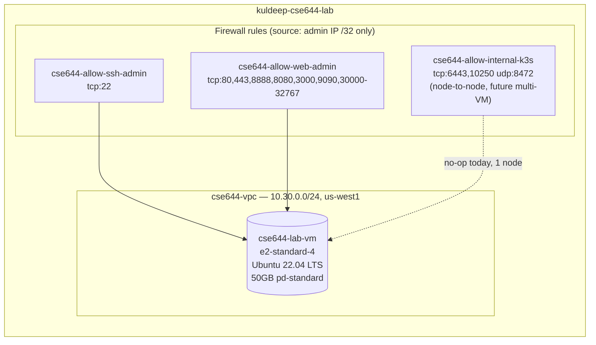

# Phase 0 — Foundation: GCP + Terraform Setup

This document covers how the underlying infrastructure for the CSE644 lab was provisioned — before any assignment-specific work began. It's the "how the VM came to exist" story; assignment content lives in its own runbook.

## Why GCP over the original Mac UTM VM

Assignment 01 was originally built on an Ubuntu Server ARM64 VM under UTM on a MacBook Air M1. That work is real and reused (see the Assignment 01 runbook's "Code Reuse" section) — but building Assignments 02 and 03 on top of a local hypervisor VM would mean nested virtualization for Kubernetes, no real cloud networking to demonstrate service exposure (ClusterIP/NodePort/LoadBalancer/Ingress) meaningfully, and no GitOps controller with anything resembling a production deployment target.

Moving to a single Terraform-provisioned GCP VM gives:
- Real cloud networking and firewall rules to reason about
- A base that extends cleanly into k3s, Argo CD, and Prometheus/Grafana without re-platforming
- Infrastructure-as-code (Terraform) as an artifact in its own right
- A structure that can later scale to multi-node k3s or GKE Autopilot as optional extensions

## Why a single VM (not multi-VM or GKE)

| Option | Verdict |
|---|---|
| Single VM + k3s | **Chosen.** Matches "practical for a small local cluster" from the Assignment 03 spec, near-zero cost, fastest to build |
| Multi-VM k3s (3 nodes) | Deferred to a future extension — real multi-node scheduling/HA, but ~6-8 extra hours of setup and debugging surface not needed for the graded submission |
| GKE Autopilot | Deferred/optional only — fastest to spin up, but drifts outside the assignment's "local Kubernetes environment" requirement; also hides the failure modes worth learning from |

## GCP project and region

- **Project:** `kuldeep-cse644-lab` (globally-unique project ID, kept fully separate from the unrelated [[devsecops-lab]] project — no shared VPC, state, or resources)
- **Region/zone:** `us-west1` / `us-west1-b` — chosen over `us-central1` after repeatedly hitting `e2` capacity stockouts there in earlier, unrelated work; also the lowest-latency major GCP region from Mountain View, CA
- **Machine type:** `e2-standard-4` (4 vCPU / 16GB) — sized to run Docker (Assignment 01), then k3s + Argo CD + Prometheus + Grafana all resident together (Assignment 03) without a resize mid-build
- **Billing:** linked to an existing billing account with active free credit; this account has a **project-linking quota of 3** (not the standard 5), which required freeing a slot before this project could be billing-enabled — see the [billing-quota issue](#billing-quota-issue-hit-along-the-way) below

## Infrastructure architecture



All resources are tagged `cse644-node` and labeled `project=cse644-cloud-lab`. The internal-k3s firewall rule is a no-op with a single node today but means the future multi-VM phase is a variable change, not a firewall rewrite.

## Repository layout for Terraform

```
terraform/
├── single-vm/       # This phase — VM, VPC, subnet, firewall (state: applied)
├── multi-vm/         # Placeholder — Phase 4 extension
└── gke-autopilot/     # Placeholder — Phase 5 extension
```

Each target has its own state and can be applied independently — `single-vm/` doesn't know or care whether `multi-vm/` or `gke-autopilot/` exist.

## Terraform apply walkthrough

```bash
cd terraform/single-vm
cp terraform.tfvars.example terraform.tfvars
# edit terraform.tfvars: project_id, admin_source_ip (your public IPv4 /32), ssh_username

terraform init
terraform plan     # review: 6 resources to add (network, subnet, 3x firewall, VM)
terraform apply    # type 'yes'
terraform output ssh_command
```

Result: `ssh testuser@<ephemeral-ip>` — a fresh Ubuntu 22.04 box reachable in ~15-20 seconds after `apply` completes.

**Note:** the external IP is ephemeral and changes every time the VM is stopped and restarted. Re-run `terraform output ssh_command` after each `gcloud compute instances start` to get the current address.

## SSH access and username convention

The Linux login username on the VM (`testuser`) is set via Terraform's `ssh-keys` instance metadata (in `compute.tf`), independent of the local Mac username or GCP account. `testuser` was chosen specifically to match the convention already used across other existing VMs (`cse636-lab-vm`, `swift-lab-vm`, `swift-idp-01`) for consistency.

## Cleaned-up default VPC

GCP auto-creates a `default` VPC (with `default-allow-ssh`, `default-allow-icmp`, `default-allow-internal`, `default-allow-rdp` firewall rules) the first time the Compute Engine API is enabled on a new project. This was deliberately removed after confirming no dependencies existed on it, so the project contains only Terraform-managed resources:

```bash
gcloud compute firewall-rules delete default-allow-icmp default-allow-internal default-allow-rdp default-allow-ssh --project=kuldeep-cse644-lab --quiet
gcloud compute networks delete default --project=kuldeep-cse644-lab
```

This has no bearing on connectivity — every GCP VPC (including the custom `cse644-vpc` Terraform creates) gets its own implicit internet-gateway route automatically; nothing here depends on the `default` network.

## Git workflow

- Repo: `kuldeepjain1920/cse644-cloud-lab`
- Branch-per-phase pattern (mirrors the [[devsecops-lab]] project's convention): `phase-0-foundation`, `assignment-01-docker`, `assignment-02-kubernetes`, `assignment-03-gitops-observability`
- Conventional Commits style: `feat(terraform): ...`, `feat(docker): ...`, `docs: ...`
- `.gitignore` excludes all `.terraform/`, `*.tfstate`, and `terraform.tfvars` files across every target directory — no state or credentials ever committed

## Billing-quota issue hit along the way

While billing-linking `kuldeep-cse644-lab`, `gcloud billing projects link` failed with a `Cloud billing quota exceeded` error. Root cause: the billing account already had 3 projects linked (this account's quota, lower than the standard 5) — one of them a mostly-unused default "My First Project" holding an unrelated CSE636 course VM (`cse636-lab-vm`).

Rather than requesting a quota increase (a multi-day review process), that VM was migrated via disk image into an existing, already-billing-enabled project (`cse636-capstone-iac`) — also moving it off `us-central1` in the process — and the now-empty old project was deleted to free a slot. This work is entirely unrelated to CSE644 and is documented separately, in full command-by-command detail, in **[cse636-vm-migration-runbook.md](cse636-vm-migration-runbook.md)** — kept out of this narrative so it doesn't clutter the CSE644 story, but linked here for completeness since it happened in the same session.

## Actual cost incurred

| Item | Estimate (pre-build) | Actual |
|---|---|---|
| VM compute (this session) | ~$5-8 over 3 weeks | **~$0.12** (52 minutes runtime, `e2-standard-4` @ ~$0.134/hr) |
| Disk (50GB pd-standard) | ~$2-3/month | negligible for a sub-hour session |
| Total this session | — | **~$0.12**, fully covered by free credit |

Cost discipline: the VM is stopped (`gcloud compute instances stop`) at the end of every session, consistent with the working pattern already used for other lab VMs.
